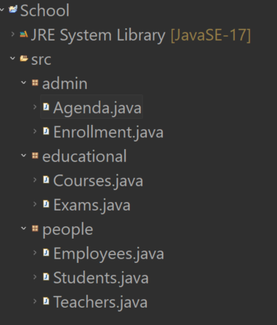

# Organizing project

---

In Java, things have different names that we would expect from our experience.

For example, a "program" is a `class`. A folder is a `package`.

In Eclipse, in order to rename a package or a class, we use `refactor` instead of `rename`, etc.

It's very important to know how to organize your code.

A Java program is a collection of Java files that collaborate with each other.

---

**Organization exercise**

- Create a project `school`
- Create several packages and classes that are logically well organized.
- Each of these classes will eventually be interacting with each other. How can we organize these classes ?
- The classes that have to be made are :
  - students
  - teachers
  - employees
  - courses
  - exams
  - enrollment
  - agenda
  - etc.

This exercise is extremely simple but aims to make you confortable creating a project, packages and classes in a logical way.

Open after completition

A possible organization for a school program could be :

---

Dumb, right ? But well organizing your program structure is veeery important in a Java project. The amount of classes can be huge in a Java program ! We and our work companions must be able to navigate through it in a logical way !

Things are gonna get harder, don't worry !
