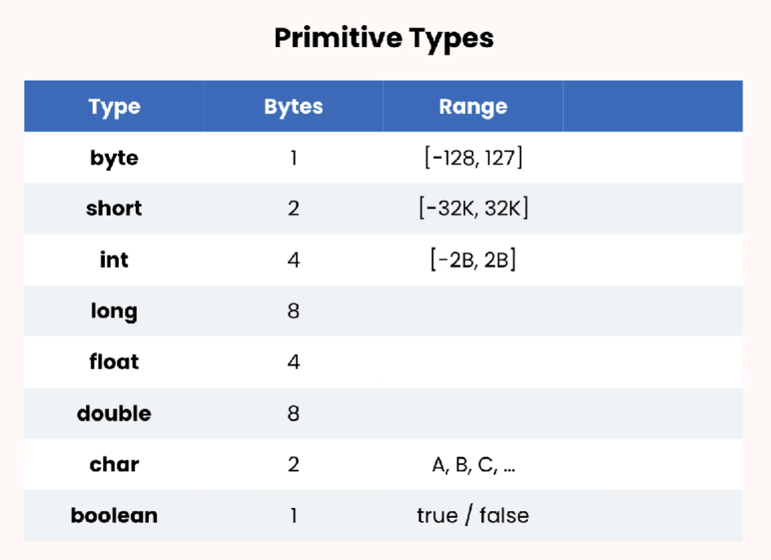

# Primitives

---

There are eight primitive types in Java :

 |

These are the caracteristics these data types have : the amount of space it takes on memory and the values it can hold.

---

Let's tackle numerical values.
If you need to create a variable to hold your age, what type will you use ?

Think about it a little bit...

...

Our first reflex would be to use an `int`. After all, if you are 32 years old, 32 is defintely an integer, without any decimals etc.

However, an `int` can hold up to 4 billion values. (-2B to 2B) and it takes 4 bytes of memory.

I don't think someone in history lived up to 2 billion years. Actually neither more than 127 years. So a `byte` will be defintely enough.

```java
byte myAge = 32;
```

Now think of a YouTube channel with millions of views. What type would it be ? `int` of course !

```java
int views = 34_364_156;
```

(Little note : see the underscore `_` ? It's just a way for us to visualize better the number that Java offers us. It doesn't change anything and it's not mandatory. It's the same as `34364156` )
