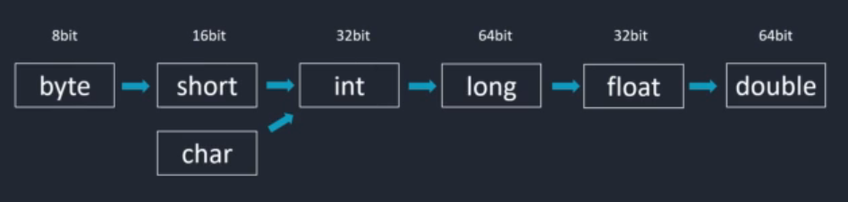
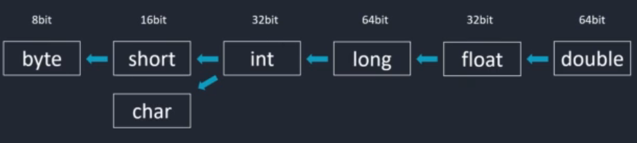

# Conversions

---

Sometimes we will need to change the type of a specific variable. This can be done through `conversion`.

As principle, the goal is to **always chose wisely the type of a variable so we don't have to convert it later**. But sometimes we won't have a choice.

In which case conversion would occur ? Let's say you have a `short` variable whose value might increase considerably. You will eventually have to adapt to it transforming it into and `int` or a `long`...

There are two types of conversion : `widening` (automatic conversion) and `narrowing` (explicit conversion).

Think of a box (the variable and the space it takes in the memory). If we have a `short` box (which takes 16bit) and we want it to become an `int` (32bit) we will be "widening" the size of the box.



In the contrary, if we want to reduce the size of the box, we will be ""narrowing" its size.



---

### Widening

From the last exercise we did, let's take the `seats` component. A car would likely have 4,5 or even 8 seats, which is defintely lower than 127 (a `byte` variable).

But let's say the company now will be selling giant buses. The `seats` byte variable will have to become a `short`.

For widening, we can easily do that by declaring a new variable and assigning it the value of the first one :

```java
byte seats = 5;

short newNumberOfSeats = seats.

// seats still holds 5, but can become much bigger now.

```

Because we are expanding, there is usually no problem with that. The problem comes when we are narrowing values because we can lose data.

### Narrowing

For example, let's convert a `double` (8bit) to an `int` (4bit).

```java
double preciseAge = 25.7;

int intAge = (int) preciseAge;

// We declare intAge as an int and we assign the (int) version of preciseAge. We call this "casting" : the process of manually converting a value from one data type to another.

System.out.println(intAge);

// Will print 25. The decimal was lost and won't come back.

```

Ok, not so hard... BUT! ... Be very carefull when narrowing. You can recive very unexpected results when the value being converted is larger than the maximum value the smaller data type can hold.

To understand that, go look for the concept of `overflow` in Java and make a little mental/math exercise. Try to understand why we get this result in the following code:

```java
short myVar = 492;

byte myConvertedVar = (byte) myVar;

System.out.print(myConvertedVar); // Prints 106 !!!!!!!!

```

---

Got it ? So... Here are some tips to avoid problems with explicit conversion:

- **Check the value range**: Ensure the value you're converting falls within the valid range of the target data type.
- **Cast only when necessary**: Avoid unnecessary casting as it can affect code readability.
- **Use appropriate data types**: Choose data types that can represent your data accurately to minimize the need for casting.
